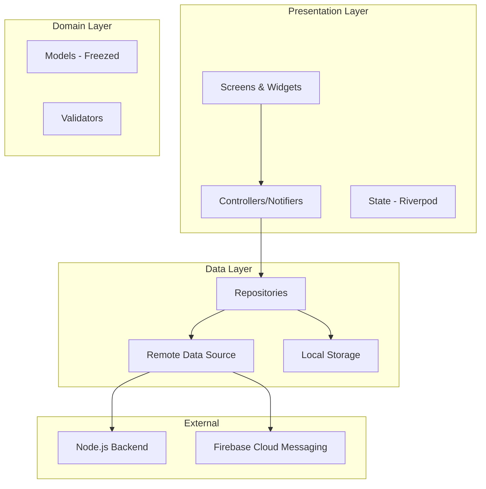
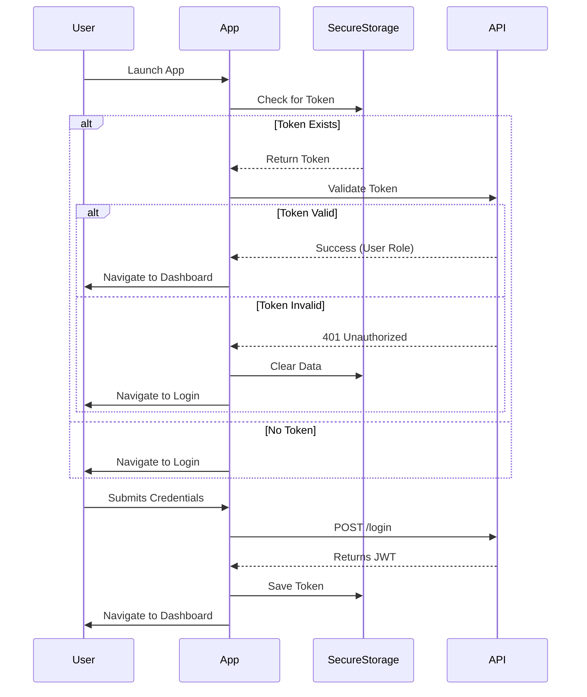

<div align="center">


# 🎓 AttendEase - Smart Attendance Management System


> **A production-grade, real-time attendance management platform streamlining academic operations with a beautiful, data-driven mobile experience.**

</div>

---

## 📖 Overview

**AttendEase** is a comprehensive solution designed to modernize the traditional educational attendance lifecycle. By bridging the gap between students and faculty through a unified mobile interface, it creates a seamless flow of data, reduces administrative burden, and provides actionable insights into academic engagement.

The system is architected to handle complex academic structures (Batches, Subjects, Semesters) while delivering a premium user experience compliant with **Material Design 3**.

### 🌟 Why AttendEase?
- **For Teachers:** Eliminates manual paperwork, streamlines batch management, and provides instant attendance tracking tools.
- **For Students:** Offers transparency into academic progress with real-time dashboard updates and timetable management.
- **For Institutions:** Centralizes academic data with a scalable, secure architecture.

---

## ✨ Key Features

### 👨‍🏫 Teacher Module
- **Smart Session Management**: Create attendance sessions dynamically with custom M3 bottom-sheet pickers for Class, Subject, and Time.
- **Bulk Operations**: Import student data via CSV and manage large batches effortlessly.
- **Real-time Tracking**: Mark and update attendance with immediate synchronization.
- **Academic Planning**: Create and manage timetables with conflict detection visually.

### 👨‍🎓 Student Module
- **Live Dashboard**: "Today's Classes" view with real-time status updates (Ongoing/Upcoming).
- **Attendance Analytics**: Visual breakdown of attendance percentage per subject with warning indicators.
- **Digital Timetable**: Interactive weekly schedule with day-wise filtering.
- **Profile Management**: Centralized student profile and setting management.

### 🎨 UI & UX Excellence
- **Material Design 3 (M3)**: Implements the "Warm Earth" design system using Sage Green, Coral, and Gold tones.
- **Interactive Elements**: Custom-built shimmers, glassmorphism effects, and micro-animations for a premium feel.
- **Responsive Layouts**: Adaptive components that look great on various screen sizes.

---

## 🏗️ System Architecture

AttendEase follows a **Feature-First Layered Architecture** powered by **Riverpod 2.0**. This approach ensures modularity, testability, and scalability.



### 🔐 Authentication Flow

The app implements a secure, token-based authentication system with automatic state restoration.



### 🧩 Component Breakdown

| Component | Technology | Role |
|-----------|------------|------|
| **Navigation** | **GoRouter** | Declarative routing with guard protection (Auth/Splash redirects). |
| **State Management** | **Flutter Riverpod** | Reactive caching, dependency injection, and state handling. |
| **Network Layer** | **Dio + Interceptors** | HTTP client with centralized error handling, retries, and token refresh. |
| **Data Modeling** | **Freezed & JsonSerializable** | Immutable data classes with union types and JSON parsing. |
| **Local Storage** | **Flutter Secure Storage** | Encrypted storage for JWT tokens and sensitive user data. |
| **Theme Engine** | **Dynamic Color** | Runtime theme generation based on the custom "Warm Earth" palette. |

---

## 🛠️ Tech Stack

### Frontend (Mobile)
| Category | Stack | rationale |
|----------|-------|-----------|
| **Framework** | Flutter (Dart) | Cross-platform high-performance rendering. |
| **State** | Riverpod 2.0 | Compile-time safe, testable state management. |
| **Routing** | GoRouter | Deep linking support and robust redirection logic. |
| **Styling** | Material 3 | Modern, accessible, and adaptive design system. |
| **Forms** | Flutter Form Builder | Complex form handling with validation. |
| **Utils** | Logger, Intl | Structured logging and date formatting. |

### Backend (Reference)
The backend infrastructure powering this app is built with **Node.js**:
👉 **[View Backend Repository](https://github.com/Raghav-28-Gupta/attendease-backend)**

---

## 🚀 Getting Started

### Prerequisites
- **Flutter SDK**: `3.19.0` or higher
- **Dart SDK**: `3.3.0` or higher
- **Android Studio / VS Code** with Flutter extensions

### Installation

1. **Clone the repository**
   ```bash
   git clone https://github.com/Raghav-28-Gupta/attendease_frontend.git
   cd attendease_frontend
   ```

2. **Install Dependencies**
   ```bash
   flutter pub get
   ```

3. **Generate Code (Freezed/Riverpod)**
   ```bash
   dart run build_runner build --delete-conflicting-outputs
   ```

4. **Environment Setup**
   Create a `.env` file in the root directory:
   ```env
   BASE_URL=http://your-backend-ip:3000/api
   SOCKET_URL=http://your-backend-ip:3000
   ```

5. **Run the Application**
   ```bash
   flutter run
   ```

---

## 📁 Project Structure

The project follows a scalable **Feature-First** directory structure:

```
lib/
├── app.dart                   # Root Widget & Theme Config
├── main.dart                 # Entry point & Initialization
├── core/                     # Application-wide shared code
│   ├── config/               # Router, Theme, Env Config
│   ├── network/              # Dio Client & Interceptors
│   ├── storage/              # Local Storage Implementation
│   └── widgets/              # Reusable UI Components (Buttons, Inputs)
├── features/                 # Feature modules
│   ├── auth/                 # Authentication (Login, Splash)
│   ├── student/              # Student-specific features
│   │   ├── dashboard/        # Dashboard logic & UI
│   │   └── timetable/        # Timetable logic & UI
│   └── teacher/              # Teacher-specific features
│       ├── attendance/       # Session & Attendance management
│       ├── batch/            # Batch CRUD & Logic
│       └── subject/          # Subject CRUD & Logic
└── assets/                   # Images, Icons, Fonts
```

---

## 🧪 Quality & Best Practices

- **Strict Linting**: Project uses `flutter_lints` with strict rules enabled to ensure code quality.
- **Error Handling**: Centralized error handling using functional programming concepts (simulated `Already/Either` pattern in repositories).
- **Responsive Design**: UI utilizes `Flex`, `Expanded`, and responsive layouts to support various device sizes.
- **Security**:
    - Secure storage for tokens.
    - Automatic token refresh interceptors.
    - Input sanitization and validation on all forms.

---

## 🤝 Contributing

We welcome contributions! Please follow these steps:

1. Fork the project.
2. Create your feature branch (`git checkout -b feature/AmazingFeature`).
3. Commit your changes (`git commit -m 'Add some AmazingFeature'`).
4. Push to the branch (`git push origin feature/AmazingFeature`).
5. Open a Pull Request.

---

---

<div align="center">

**Built with ❤️ by Raghav Gupta**

[](https://github.com/Raghav-28-Gupta)
[](https://linkedin.com/in/)

</div>
